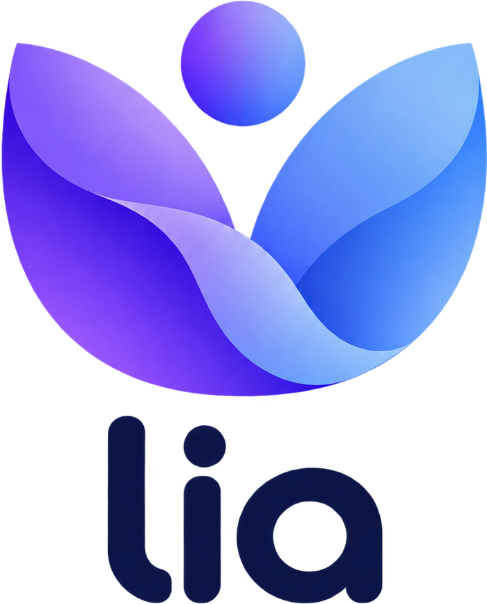
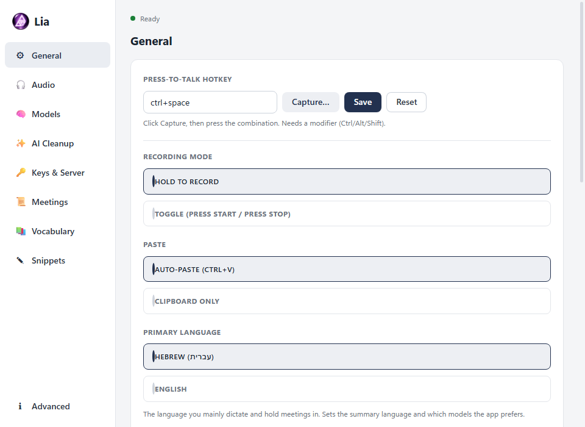
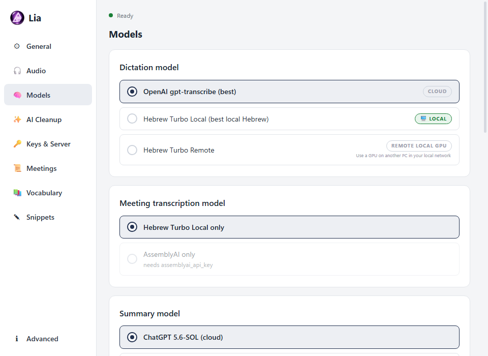

<div align="center">



# Lia

**Local Inference Assistant** - push-to-talk dictation and meeting intelligence for Windows.
Local-first, Hebrew and English, zero friction.

[](https://github.com/Danaor/lia/releases/latest)
[](https://www.python.org/downloads/)
[](https://www.microsoft.com/windows)
[](https://opensource.org/licenses/MIT)

</div>

---

Hold a hotkey, speak, release - your words appear wherever your cursor is. Record a meeting and get a live transcript, speaker names, and a faithful AI summary with a real task list. Ask questions about everything your meetings ever said - fully on your own machine.

<div align="center">
<table><tr>
<td></td>
<td></td>
</tr></table>
</div>

> **About the name.** L.I.A stands for **Local Inference Assistant**. It is also my daughter's name, which is the better reason.

## Why Lia?

Most dictation tools are subscriptions (SuperWhisper, Wispr Flow), cloud-locked (Otter, Rev), or mediocre outside English. Lia is different:

- **Local-first.** Dictation, meeting transcription, diarization, summaries, and search can all run 100% on your machine. Disconnect the WiFi - everything still works.
- **Hebrew that actually works.** The excellent [ivrit.ai](https://huggingface.co/ivrit-ai) fine-tuned Whisper models, plus a pipeline built for Hebrew business meetings.
- **English that actually works.** NVIDIA [Parakeet](https://huggingface.co/nvidia/parakeet-tdt-0.6b-v2) as a dedicated local English engine - better English accuracy than Whisper large-v3-turbo at ~15x the speed, with native punctuation, running in realtime on a plain CPU.
- **One switch for your language.** Settings -> General -> Primary language sets the dictation model, meeting model, and summary language together. Mixed-language meetings are auto-routed per segment (Hebrew goes to the Hebrew model, English to the English one).
- **Cloud when you want it.** Optional Groq / OpenAI transcription and cloud summaries, with automatic fallback to local when the network fails.
- **Free and open source.** MIT licensed. No accounts, no telemetry, no payment wall.

## What it does

### Dictation

| | |
|---|---|
| **Push-to-talk** | Hold `Ctrl+Space`, speak, release - text is pasted at your cursor |
| **Local engines** | ivrit.ai Hebrew Whisper, NVIDIA Parakeet (English), general Whisper |
| **Cloud engines** | Groq Whisper (free tier, ~0.5s), OpenAI gpt-transcribe |
| **Bilingual auto-routing** | Each utterance is language-detected and sent to the best model |
| **AI cleanup** (optional) | Removes fillers / resolves self-corrections ("meet at 5, actually 6" -> "meet at 6") |
| **Self-learning vocabulary** | Learns your domain terms and fixes recurring speech-to-text garbles |
| **Snippets, undo, history** | Voice snippets, `Ctrl+Alt+Z` undo-paste, searchable history window |

### Meetings

| | |
|---|---|
| **One-click recording** | Mic + system audio (both sides of the call), with a live transcript window |
| **Local diarization** | pyannote speaker turns + per-turn transcription - who said what, offline |
| **Speaker naming** | Calendar attendees, mic-channel self-detection, learning voiceprints, and an evidence-based LLM name pass |
| **Faithful summaries** | A project-manager-grade summary with decisions, highlights, and a complete `- [ ]` task list with owners - in Hebrew or English, local (Ollama) or cloud |
| **Ask your meetings** | Local RAG over every meeting - factual, synthesis, and action-item questions |
| **Action-item tracker** | Every open task across all meetings in one window |
| **Voice Ask** | Hotkey -> speak a question -> get an answer card from your meetings |

### Experimental

| | |
|---|---|
| **Email search** | A fully local index of your Outlook mail (SQLite FTS5 + embeddings) with keyword search, semantic search, and "ask your email" over a local model. Windows + Outlook desktop only, and rougher than the rest of the app - treat it as an experiment that happens to be useful. |

## Quick start

```bash
git clone https://github.com/Danaor/lia.git
cd lia/lia
pip install -r requirements.lock
python lia.py
```

(`requirements.lock` is the pinned, hash-verified dependency set; use
`requirements.txt` instead if you prefer resolving the latest compatible
versions yourself.)

On first run the app picks your primary language from Windows, downloads the matching model (Hebrew Turbo ~1.6 GB / Parakeet ~670 MB), and sits in the system tray. Left-click the tray icon for Settings. Lia pins its icon next to the clock on the first run; if Windows still tucks it behind the `^` overflow arrow, drag the orb out once and it stays. Lia runs non-elevated by default; if you also want to dictate into admin windows, launch through `run.bat` - note that this runs the whole app with highest privileges for the session.

Optional cloud speed: get a free [Groq key](https://console.groq.com/keys), paste it into Settings -> Keys & Server, and pick Groq in Settings -> Models.

## Models

| Purpose | Local (free, offline) | Cloud (optional) |
|---|---|---|
| Hebrew dictation | ivrit.ai Whisper large-v3-turbo | Groq Whisper, OpenAI gpt-transcribe |
| English dictation | **NVIDIA Parakeet TDT 0.6B** (best English WER, realtime on CPU) | Groq Whisper, OpenAI gpt-transcribe |
| Meetings | chunked or diarized (pyannote) variants of the above | AssemblyAI, OpenAI |
| Summaries | Gemma via [Ollama](https://ollama.com) | OpenAI, Gemini (free tier) |

Have one GPU box and several machines? Lia can also send audio to a WhisperLive server you host yourself - see [docs/SELF_HOSTED_SERVER.md](docs/SELF_HOSTED_SERVER.md).

## Requirements

- **OS**: Windows 10/11 (WASAPI for system audio)
- **Python**: 3.11+ (developed on 3.13)
- **RAM**: 8 GB minimum, 16 GB recommended
- **GPU**: **strongly recommended** - see the performance table below. Everything works without one, but meeting processing is significantly slower. NVIDIA only (CUDA); AMD and Intel GPUs are not supported.
- **Internet**: only for the first model download and optional cloud modes

Settings live in `%APPDATA%\Lia\config.json`; every option is in the Settings window (tray left-click).

### Performance: CPU vs GPU

Everything in Lia runs on CPU, but an NVIDIA GPU makes local transcription dramatically faster. Short dictation clips are usable either way; meetings are where the GPU really matters.

| Task | CPU only | With NVIDIA GPU |
|---|---|---|
| **Dictation** (10s clip, Hebrew) | 5-15s wait | under 1s |
| **Dictation** (10s clip, English Parakeet) | ~2s (fast on CPU) | ~1s |
| **Meeting** (1h, chunked - no speaker names) | Keeps up during recording | Keeps up, no backlog |
| **Meeting** (1h, diarized - with speaker names) | 60-90 min post-processing | 5-10 min |
| **Local summary** (Ollama, gemma4 31B) | Very slow (needs 32 GB+ RAM) | 2-5 min (needs 20+ GB VRAM) |

> **Bottom line:** for dictation-only use, CPU is fine - you wait a few seconds after releasing the hotkey. For meetings with speaker identification, a GPU turns a 90-minute wait into a 10-minute one.

### Recommended GPUs

| Tier | Examples | VRAM | What it unlocks |
|---|---|---|---|
| Entry | GTX 1650, RTX 3050 | 4-6 GB | Fast dictation |
| **Recommended** | **RTX 3060, RTX 4060** | **8-12 GB** | Fast dictation + diarized meetings |
| Power user | RTX 3090, RTX 4090 | 24 GB | All of the above + local AI summaries (Ollama) |

Already have a GPU on another machine? Lia's [remote mode](docs/SELF_HOSTED_SERVER.md) lets a laptop without a GPU use your home PC's GPU over the network.

## Privacy

Everything can run locally: audio capture, transcription, diarization, speaker naming, summaries (Ollama), vocabulary learning, and meeting search never have to leave your machine. Cloud backends are opt-in per feature and clearly labeled. Meeting audio is kept (WAV short-term, Opus long-term) so a bad transcription is never a lost meeting - retention is configurable.

## Contributing

Bug reports and pull requests are welcome - see [CONTRIBUTING.md](CONTRIBUTING.md) for the dev setup and how to run the test suite.

## License and attribution

MIT for Lia's code. The models it uses carry their own licenses:

- [NVIDIA Parakeet TDT 0.6B v2](https://huggingface.co/nvidia/parakeet-tdt-0.6b-v2) - CC-BY-4.0 (local English ASR), via [onnx-asr](https://github.com/istupakov/onnx-asr)
- [ivrit.ai Whisper models](https://huggingface.co/ivrit-ai) - Hebrew fine-tunes of OpenAI Whisper
- [pyannote speaker-diarization-community-1](https://huggingface.co/pyannote/speaker-diarization-community-1) - CC-BY-4.0 (local diarization)
- [faster-whisper](https://github.com/SYSTRAN/faster-whisper) / CTranslate2 - fast local Whisper inference
- [PyAudioWPatch](https://github.com/s0d3s/PyAudioWPatch) - WASAPI loopback recording
- [Groq](https://groq.com) - fast cloud Whisper inference

---

*Built because I wanted SuperWhisper on Windows with good Hebrew support and no subscription. It grew into a full local meeting-intelligence stack. The ingredients were all open source - they just needed gluing together.*
