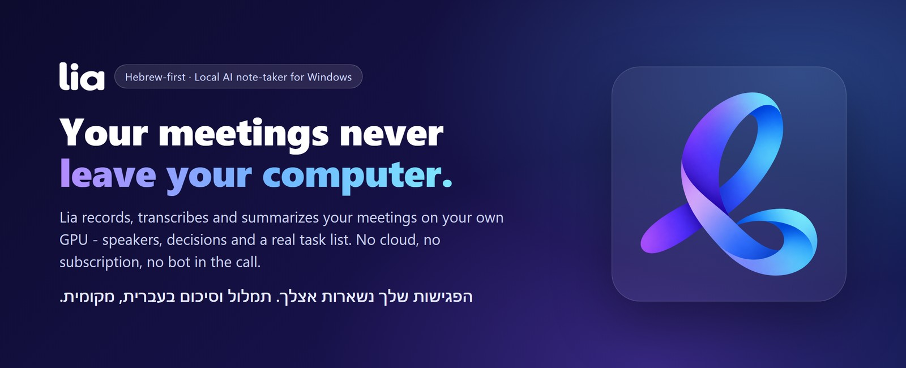
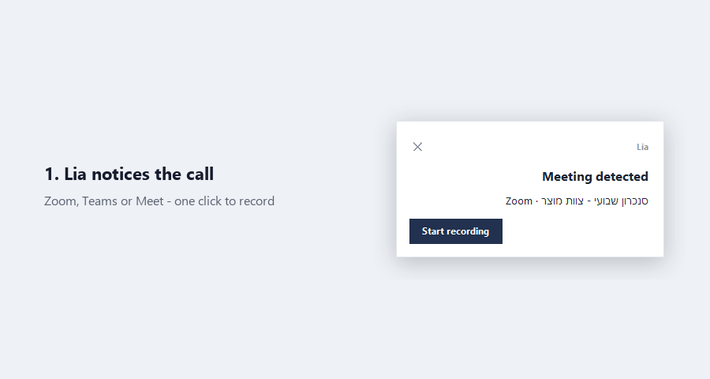
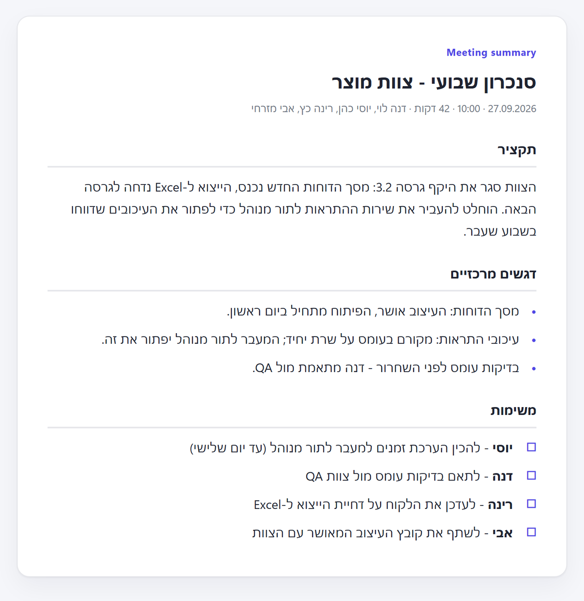
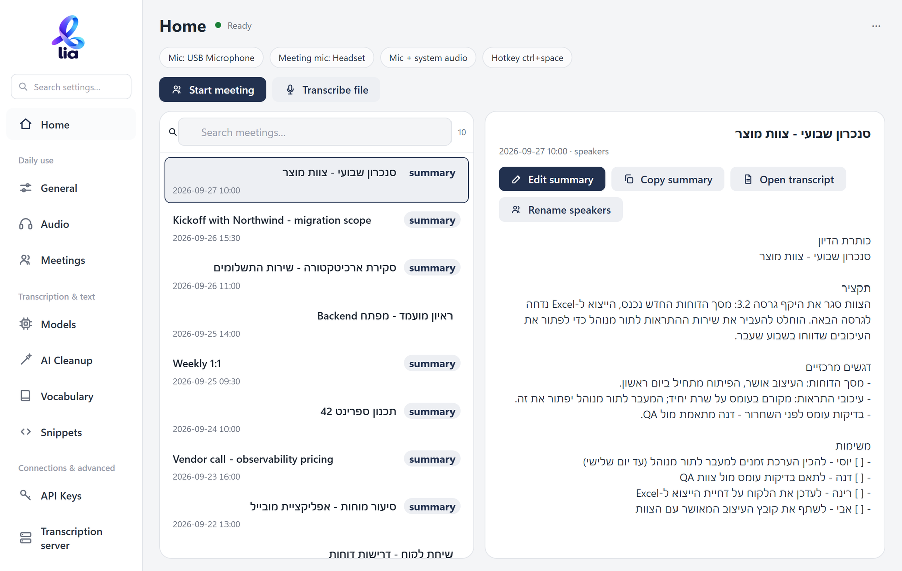
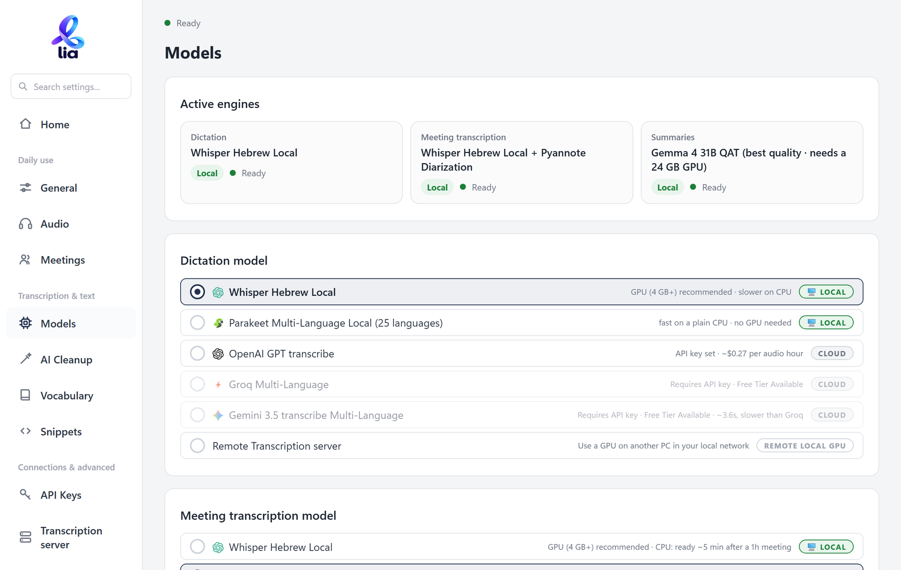

<div align="center">



<br>

[](https://github.com/Danaor/lia/releases/latest)
[](https://github.com/Danaor/lia/releases/latest)
[](#-private-by-design)
[](#-hebrew-first)
[](LICENSE)

**[Download for Windows](https://github.com/Danaor/lia/releases/latest)** &nbsp;·&nbsp; [How it works](#-how-a-meeting-works) &nbsp;·&nbsp; [GPU guide](#-what-you-need) &nbsp;·&nbsp; [No GPU?](#-no-gpu-no-problem) &nbsp;·&nbsp; [Privacy](#-private-by-design)

</div>

---

## An AI note-taker that stays on your computer

Most AI note-takers join your call as a bot, upload the recording to their cloud, and charge you every month. **Lia does none of that.**

Lia sits quietly in your Windows tray. When a meeting starts, it records both sides of the call, transcribes it, works out who said what, and writes a clear summary with decisions and a real task list - **all on your own computer, on your own GPU.** The audio, the transcript and the summary never leave your machine at any point.

- 🔒 **Nothing leaves your computer.** Recording, transcription, speaker identification and the AI summary all run locally. Unplug the network - it still works.
- 🗣 **Hebrew first.** Built from day one for Hebrew and for real Israeli meetings that jump between Hebrew and English mid-sentence.
- 🧠 **Summaries that don't lose the details.** A multi-stage summary pipeline built so that even a two-hour meeting comes out complete - every topic, every decision, every task - from a model running on your own GPU.
- 🤖 **No bot in your call.** Lia records the audio on your PC. Nobody sees a "Notetaker has joined" message.
- 💸 **Free and open source.** No account, no subscription, no per-minute pricing. MIT license.

<div align="center">

</div>

## 🎙 How a meeting works

1. **Start** - click *Start meeting*, or turn on meeting detection and Lia offers to record when your Zoom / Teams / Google Meet call begins.
2. **Record** - your microphone and the call's audio are captured on your computer. A live transcript window follows the conversation as it happens.
3. **Transcribe** - when the call ends, Lia transcribes the full meeting with a Hebrew-tuned speech model and separates the speakers.
4. **Name the speakers** - Lia knows your voice, learns the people you meet often, and uses your calendar invitees to put real names on each speaker.
5. **Summarize** - a local AI model (via [Ollama](https://ollama.com)) writes the summary: the gist, the key points, what was decided, and every task with its owner.
6. **Done** - the summary and full transcript are saved in your meetings folder. Copy it, edit it, or send it on.

<div align="center">

<br><sub>A real-looking Hebrew summary (demo data) - the gist, key points and every task with its owner</sub>
</div>

## 🧠 Meeting summaries that don't lose the details

**The hard part of a local AI note-taker is not the transcript - it is the summary.**

Local models are small. Hand one a 90-minute transcript in a single prompt, and things quietly go missing: the part of the meeting that did not fit is cut off, topics from the middle of the conversation fade, and the task someone agreed to in minute 47 never makes it to the list. The summary *looks* fine - you only find out what was missing when it matters.

Lia does not ask one model call to do everything. It runs the summary as a **pipeline**, where each stage has one job and plain code checks the work:

| Stage | What it does |
|---|---|
| **1. Right-sized context** | The transcript is measured before the call, so the model always sees all of it - nothing is silently cut off. |
| **2. Overlapping windows** | Long meetings are split into windows that overlap by 3-4 minutes, so a discussion that crosses a boundary is always seen whole. Each window is summarized, then the notes are merged. |
| **3. Depth pass** | Lia goes back to the raw transcript, writes a short narrative per topic - the numbers, the *why*, who backed what - and lets the model improve its own summary against them (local Hebrew summaries of longer meetings). |
| **4. Merge and close** | A topic discussed twice becomes one clear point, and a task that was already done during the meeting is marked done instead of left open. |
| **5. Code checks every edit** | A rewrite is accepted only if it is not shorter and keeps every number, name and qualifier, and adds no claim that something was completed - otherwise the original stays. Plain code then cleans up known failure patterns (a speaker label instead of a name, a duplicated task) - no AI involved. |

**The result:** on a real 71-minute meeting, the depth pass recovered **all four** substantive points that a single-pass summary had dropped. Long meetings get the same care as short ones, and the summary tells you what was decided, why, and who owns each task.

The same standards apply when you choose a cloud engine: OpenAI and Gemini get Lia's coverage rules - every topic discussed appears at least once, small talk never becomes a task - plus the same code clean-up on the result.

No summary is perfect, and Lia keeps the full transcript next to every summary so you can always check. But a summary that quietly drops half the meeting is exactly the problem this pipeline was built to solve.

## 🗣 Hebrew first

Hebrew is where most transcription tools fall apart. Lia was built for it:

- **The best open Hebrew speech models,** from [ivrit.ai](https://huggingface.co/ivrit-ai), running locally on your GPU.
- **Mixed Hebrew and English.** Real meetings switch languages mid-sentence. Lia sends each part to the right model and keeps the English terms in English.
- **Learns your vocabulary.** Product names, clients and technical terms are picked up from your meetings and fixed automatically after you approve them.
- **Summaries written in Hebrew,** laid out right to left, with the tasks and names where you expect them.
- **Not only Hebrew.** English gets a dedicated engine (NVIDIA Parakeet), and Lia transcribes 99 languages with Whisper.

## 🔒 Private by design

Your meetings are some of the most sensitive data you have: clients, salaries, strategy, people. Lia is built so that data stays with you.

| | With Lia (local mode) |
|---|---|
| Where is the audio? | On your computer only |
| Who transcribes it? | Your own GPU |
| Who writes the summary? | A model running on your own GPU (Ollama) |
| Does anyone join the call? | No - Lia listens to your PC's audio, not the meeting |
| Account or sign-up? | None |
| Can it work offline? | Yes, after the first model download |

Cloud engines (OpenAI, Gemini, Groq) are there **only if you want them** - see [No GPU? No problem](#-no-gpu-no-problem). Each one is opt-in, clearly labeled *CLOUD* in Settings, and never used behind your back. Updates are installed only when you click *Update*, and only when the release is signed by the Lia release key. The details are in [SECURITY.md](SECURITY.md).

## 🖥 What you need

Windows 10 or 11. For the fully local, nothing-leaves-your-computer experience you need an **NVIDIA graphics card**. How much video memory (VRAM) it has decides how good the local summary is:

| GPU memory (VRAM) | Example cards | What you get locally |
|---|---|---|
| **8 GB** (minimum) | RTX 3060 Ti, RTX 4060 | Fast Hebrew transcription + a quick local recap (Gemma 3 4B) |
| **12 GB** (good) | RTX 3060 12 GB, RTX 4070 | The above + speaker separation on long meetings with room to spare |
| **16 GB** (recommended) | RTX 4060 Ti 16 GB, RTX 4080 | Full, detailed project-style summaries (Gemma 3 12B) |
| **24 GB** (best) | RTX 3090, RTX 4090 | The best local summary quality (Gemma 4 31B) - what Lia is developed on |

**Dictation** needs far less - any machine that runs Windows 11 will do.

## 💡 No GPU? No problem

If your meetings are not especially sensitive, you don't need a graphics card at all. Lia works just as well with **OpenAI** and **Google Gemini** - for **both meeting transcription and meeting summaries** - and you get the full Lia experience: the same fast, stable app, the same Hebrew summaries with decisions and tasks, on any Windows laptop.

- **Gemini has a generous free tier.** Create a free key in [Google AI Studio](https://aistudio.google.com/apikey), paste it into *Settings > API Keys*, and pick Gemini in *Settings > Models*. Transcription, summaries and even speaker labels (beta) - at no cost.
- **OpenAI** (paid, pay-as-you-go) gives excellent accuracy - roughly $0.27 per hour of meeting audio and about $0.05 per summary.
- **Groq** (free tier) makes dictation nearly instant.
- **No middleman.** You use your own API key, and Lia talks directly to the provider's API. There is no Lia server, no account with us, and nobody in between - your audio and text go only to the provider you chose, under your own agreement with them.

You can also mix and match: transcribe locally on a modest GPU and summarize in the cloud, or the other way around. Every engine is labeled *LOCAL* or *CLOUD*, so you always know where your data goes.

<div align="center">

<br><sub>All your meetings in one place - search them, open a summary, rename speakers</sub>
</div>

## ⌨️ Dictation, too

Lia started as a dictation tool, and it is still one of the best on Windows:

- Press **`Ctrl+Space`**, speak, press again - your words are typed wherever your cursor is: email, WhatsApp, Word, code.
- Hebrew, English, or both in one sentence.
- Optional AI cleanup removes "umm" and false starts ("at 5, actually 6" becomes "at 6").
- Voice snippets, `Ctrl+Alt+Z` to undo a paste, and a searchable history.

## ✨ Everything else

| | |
|---|---|
| **Ask your meetings** | Ask a question and get the answer from everything your meetings ever said - "what did we decide about the pricing?" |
| **Action items** | Every open task from every meeting, in one window |
| **Voice Ask** | Press a hotkey, ask out loud, get an answer card |
| **Transcribe a file** | Drop in any recording (mp3, m4a, wav, video) and get a transcript and summary |
| **Summary styles** | Technical / project notes, a general recap, or formal minutes (with a cloud summary engine) |
| **Remote GPU** | Laptop without a GPU? Use the GPU of your PC at home over your own network - see [docs/SELF_HOSTED_SERVER.md](docs/SELF_HOSTED_SERVER.md) |

<div align="center">

<br><sub>Every engine is labeled LOCAL or CLOUD - you always know where your audio goes</sub>
</div>

## 🚀 Get started

1. **Download** `Lia-Setup` from the [latest release](https://github.com/Danaor/lia/releases/latest) and run it (no admin rights needed). Prefer no installer? Take `Lia-Portable`, extract it anywhere and double-click `Lia.bat`.
2. **Find Lia in the tray** next to the clock and click it to open Settings. On the first run it downloads the speech model for your language (about 1.6 GB for Hebrew).
3. **For local summaries**, install [Ollama](https://ollama.com) and pull the model that fits your GPU:
   ```bash
   ollama pull gemma3:4b          # 8 GB GPU
   ollama pull gemma3:12b         # 16 GB GPU
   ollama pull gemma4:31b-it-qat  # 24 GB GPU
   ```
   Then pick it in **Settings > Models > Summaries**.
4. **Start a meeting** from the tray or the Home screen. That's it.

Windows SmartScreen may warn on the first run because Lia is not code-signed yet: click *More info* > *Run anyway*. Lia checks for new versions and updates itself when you click *Update*.

<details>
<summary><b>Run from source (developers)</b></summary>

Requires [Python 3.11+](https://www.python.org/downloads/) (developed on 3.13).

```bash
git clone https://github.com/Danaor/lia.git
cd lia/lia
pip install -r requirements.lock
python lia.py
```

`requirements.lock` is the pinned, hash-verified dependency set. See [CONTRIBUTING.md](CONTRIBUTING.md) for the test suite.
</details>

<details>
<summary><b>Troubleshooting</b></summary>

- **Locked / corporate PC, `Lia.exe` blocked ("Access denied"):** run **`Lia (Work PC).bat`** from the portable folder. It starts Lia through the code-signed `pythonw.exe`, which WDAC / AppLocker policies allow.
- **Settings window does not open after extracting the zip:** Lia 1.4.2+ clears Windows' "Mark of the Web" automatically. On an older build, right-click the zip > Properties > **Unblock** before extracting.
- **Lia is not in the tray after a reboot:** `%APPDATA%\Lia\startup_trace.log` records every launch attempt. Settings > Advanced > *Report a problem* bundles it (with personal details removed).
- **Dictating into admin windows** (Task Manager, admin consoles): Lia runs without admin rights by default. The installer can set up an elevated start when Lia is installed under Program Files.
- **The tray icon is hidden** behind the `^` arrow: drag it next to the clock once and it stays.
</details>

<details>
<summary><b>All engines</b></summary>

| Purpose | Local (free, offline) | Cloud (optional) |
|---|---|---|
| Hebrew | ivrit.ai Whisper large-v3-turbo | Groq Whisper, OpenAI gpt-transcribe, Gemini Transcribe (free tier) |
| English + 24 European languages | NVIDIA Parakeet TDT 0.6B v3 (fast even on CPU) | same as above |
| 99 languages | Whisper large-v3-turbo | same as above |
| Speaker separation | pyannote community-1 | Gemini Transcribe diarization (beta) |
| Summaries | Gemma via Ollama (4B / 12B / 31B) | OpenAI, Gemini (free tier) |

| Task | CPU only | With an NVIDIA GPU |
|---|---|---|
| Dictation, 10 s of Hebrew | 5-15 s | under 1 s |
| Dictation, 10 s of English (Parakeet) | about 2 s | about 1 s |
| 1-hour meeting with speaker names | 60-90 min after the call | 5-10 min |
| Local summary of a 1-hour meeting | not practical | 2-5 min |
</details>

## 💜 About the name

**L.I.A** stands for **Local Inference Assistant** - which is exactly what it does. The name itself was inspired by a little girl at home.

## Contributing

Bug reports, ideas and pull requests are welcome - see [CONTRIBUTING.md](CONTRIBUTING.md). Found a security issue? Please report it privately, as described in [SECURITY.md](SECURITY.md).

## License and credits

Lia's code is MIT licensed. It stands on the shoulders of excellent open models and libraries, each under its own license:

- [ivrit.ai Whisper models](https://huggingface.co/ivrit-ai) - Hebrew fine-tunes of OpenAI Whisper
- [NVIDIA Parakeet TDT 0.6B v3](https://huggingface.co/nvidia/parakeet-tdt-0.6b-v3) - CC-BY-4.0, via [onnx-asr](https://github.com/istupakov/onnx-asr)
- [pyannote speaker-diarization-community-1](https://huggingface.co/pyannote/speaker-diarization-community-1) - CC-BY-4.0
- [faster-whisper](https://github.com/SYSTRAN/faster-whisper) / CTranslate2 - fast local Whisper inference
- [Gemma](https://ai.google.dev/gemma) via [Ollama](https://ollama.com) - local summaries
- [hspell Hebrew word list](http://hspell.ivrix.org.il/) via [dictionary-he](https://github.com/wooorm/dictionaries/tree/main/dictionaries/he) - AGPL-3.0, downloaded on demand for the Hebrew spelling fix, never bundled
- [PyAudioWPatch](https://github.com/s0d3s/PyAudioWPatch) - recording the call audio (WASAPI loopback)

---

<div align="center">
<sub>Made in Israel for people who talk in Hebrew, think in two languages, and would rather keep their meetings to themselves.</sub>
</div>
